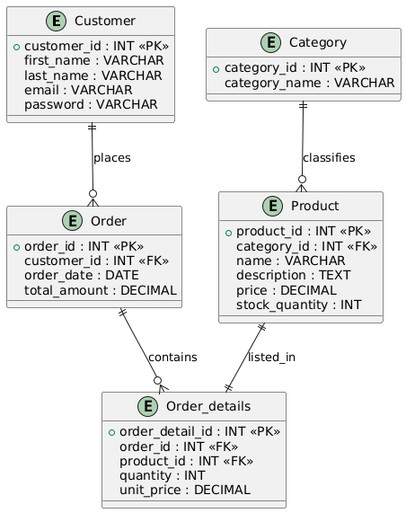

# 🛒 Practical-eCommerce

## 📑 Table of Contents

- [📘 ERD](#-11-erd)
- [📦 Create the Database Schema](#-task-1-create-the-database-schema)
- [📦 Daily Revenue Report](#-task-2-daily-revenue-report)
- [📦 Monthly Top-Selling Products](#-task-3-monthly-top-selling-products)
- [📦 High-Value Customers (Past Month)](#-task-4-high-value-customers-past-month)
- [🔄 Denormalization Task: Flattening the Category Tree](#-21-denormalization-task-flattening-the-category-tree)
- [🔍 Search Products with the Word "Camera"](#-task-search-products-with-the-word-camera)
- [🔍 Recommended top products forcustomer](#-task-recommended-top-products-forcustomer)
- [🧾 Table `sales_history`](#-task-table-sales_history)
- [🧾 LOCK field quantity AT TABLE `Product`](#-task-lock-field-quantity-at-table-product)
- [🧾 LOCK ROW AT TABLE `Product`](#-task-lock-row-at-table-product)
- [Populate Database with 5 Million Records](#task-populate-database-with-5-million-records)
- [Query comparison](#task-query-comparison)
- [Create database functions to seeds database](#task-create-database-functions-to-seeds-database)
- [Query comparison and enhancement](#task-query-comparison-and-enhancement)


## 📘 1.1 ERD



## 📊 Entity Relationships

- **Customer → Order**  
  Type: One-to-Many

- **Order → Order_details**  
  Type: One-to-Many

- **Order_details → Product**  
  Type: One-to-One

- **Category → Product**  
  Type: One-to-Many

---
## 📦 Task 1: Create the Database Schema
```sql
SET FOREIGN_KEY_CHECKS = 0;

CREATE TABLE Category (
    category_id INT AUTO_INCREMENT PRIMARY KEY,
    category_name VARCHAR(100) NOT NULL
);

CREATE TABLE Product (
    product_id INT AUTO_INCREMENT PRIMARY KEY,
    category_id INT,
    name VARCHAR(100),
    description TEXT,
    price DECIMAL(10, 2),
    stock_quantity INT
);

CREATE TABLE Customer (
    customer_id INT AUTO_INCREMENT PRIMARY KEY,
    first_name VARCHAR(50),
    last_name VARCHAR(50),
    email VARCHAR(100),
    password VARCHAR(100)
);

CREATE TABLE `Order` (
    order_id INT AUTO_INCREMENT PRIMARY KEY,
    customer_id INT,
    order_date DATE,
    total_amount DECIMAL(10, 2)
);

CREATE TABLE Order_details (
    order_detail_id INT AUTO_INCREMENT PRIMARY KEY,
    order_id INT,
    product_id INT,
    quantity INT,
    unit_price DECIMAL(10, 2)
);

ALTER TABLE Product
ADD CONSTRAINT fk_product_category
FOREIGN KEY (category_id) REFERENCES Category(category_id);

ALTER TABLE `Order`
ADD CONSTRAINT fk_order_customer
FOREIGN KEY (customer_id) REFERENCES Customer(customer_id);

ALTER TABLE Order_details
ADD CONSTRAINT fk_orderdetails_order
FOREIGN KEY (order_id) REFERENCES `Order`(order_id);

ALTER TABLE Order_details
ADD CONSTRAINT fk_orderdetails_product
FOREIGN KEY (product_id) REFERENCES Product(product_id);

SET FOREIGN_KEY_CHECKS = 1;
```
## 📦 Task 2: Daily Revenue Report
```sql
USE ecommerce;

SELECT 
    order_date,
    SUM(total_amount) AS total_revenue
FROM 
    `Order`
GROUP BY 
    order_date
ORDER BY 
    order_date;
```
## 📦 Task 3: Monthly Top-Selling Products
```sql
USE ecommerce;

SELECT 
    p.product_id,
    p.name AS product_name,
    SUM(od.quantity) AS total_quantity_sold,
    SUM(od.quantity * od.unit_price) AS total_revenue
FROM 
    Order_details od
JOIN 
    `Order` o ON od.order_id = o.order_id
JOIN 
    Product p ON od.product_id = p.product_id
WHERE 
    o.order_date BETWEEN '2025-05-01' AND '2025-05-31'
GROUP BY 
    p.product_id, p.name
ORDER BY 
    total_quantity_sold DESC;
```
---
## 📦 Task 4: High-Value Customers (Past Month)
```sql
USE ecommerce;

SELECT 
    c.customer_id,
    c.first_name,
    c.last_name,
    SUM(o.total_amount) AS total_spent
FROM 
    `Order` o
JOIN 
    Customer c ON o.customer_id = c.customer_id
WHERE 
    o.order_date BETWEEN DATE_SUB(CURDATE(), INTERVAL 31 DAY)
                    AND DATE_SUB(CURDATE(), INTERVAL 1 DAY)
GROUP BY 
    c.customer_id, c.first_name, c.last_name
HAVING 
    total_spent > 500
ORDER BY 
    total_spent DESC;

```
---

## 🔄2.1 Denormalization Task: Flattening the Category Tree

In eCommerce systems, categories often form a hierarchical structure. To simplify access and improve performance (e.g., for breadcrumb navigation or filtering), we flatten the tree into a readable and queryable format.

### 🧱 Step 1: Create the Flattened Table

```sql
CREATE TABLE CategoryPath (
    CatID INT PRIMARY KEY,
    FullPath VARCHAR(1000),     -- e.g., "Electronics > Phones > iPhone"
    FullPathIDs VARCHAR(500),   -- e.g., "1 > 2 > 7"
    PathDepth INT               -- e.g., 3
);
```

### 🧱 Step 2: Recursive Query to Populate It

```sql
WITH RECURSIVE category_tree AS (
    -- Anchor: Root categories (no parent)
    SELECT 
        id,
        name,
        parent_id,
        CAST(name AS CHAR(1000)) AS full_path,
        CAST(id AS CHAR(1000)) AS full_path_ids,
        1 AS depth
    FROM categories
    WHERE parent_id IS NULL

    UNION ALL

    -- Recursive: Join children to parent paths
    SELECT 
        c.id,
        c.name,
        c.parent_id,
        CONCAT(ct.full_path, ' > ', c.name),
        CONCAT(ct.full_path_ids, ' > ', c.id),
        ct.depth + 1
    FROM categories c
    INNER JOIN category_tree ct ON c.parent_id = ct.id
)

-- Final output
SELECT 
    id AS CatID,
    full_path AS FullPath,
    full_path_ids AS FullPathIDs,
    depth AS PathDepth
FROM category_tree
ORDER BY FullPath;
```

### 🧱 Step 3: Automating Updates

use a scheduled job to refresh the entire CategoryPath table periodically

---

## 🔍 Task: Search Products with the Word "Camera"
### 📝 Solution 1: Basic LIKE Query

```sql
SELECT *
FROM Product
WHERE name LIKE '%camera%'
   OR description LIKE '%camera%';
```
⚠️ This query is not optimal for large datasets as it results in a full table scan due to the leading wildcard %.

### 📝 Solution 2: Optimized Full-Text Search
```sql
--- First, add a full-text index on the name and description columns:
ALTER TABLE Product 
ADD FULLTEXT(name, description);

--- Then use MATCH with AGAINST to perform a fast, indexed search:
SELECT *
FROM Product
WHERE MATCH(name, description) AGAINST('camera' IN NATURAL LANGUAGE MODE);
```

---

## 🔍 Task: Recommended top products forcustomer
```sql
SELECT 
    p.product_id,
    p.name,
    SUM(od.quantity) AS total_quantity_sold
FROM Products p
JOIN OrderDetails od ON p.product_id = od.product_id
WHERE NOT EXISTS ( --- remove products that customer did buy beofre
    SELECT 1
    FROM Orders o
    JOIN OrderDetails od2 ON o.order_id = od2.order_id
    WHERE o.customer_id = :givenCustomerId
      AND od2.product_id = p.product_id
)
AND (p.category_id, p.brand, p.company) IN ( --- filter by brand and company
    SELECT DISTINCT p.category_id, p.brand, p.company
    FROM Orders o
    JOIN OrderDetails od ON o.order_id = od.order_id
    JOIN Products p ON od.product_id = p.product_id
    WHERE o.customer_id = :givenCustomerId
)
GROUP BY p.product_id, p.name
ORDER BY total_quantity_sold DESC
```

---

## 🧾 Task: Table `sales_history`
The `sales_history` table stores a denormalized snapshot of each product sold in an order. It combines key data from multiple tables — including customer info, product details, and category — to enable fast reporting and analytics without joins.
This table is automatically populated whenever a new order is placed.
```sql
CREATE TABLE sales_history (
    history_id INT AUTO_INCREMENT PRIMARY KEY,
    order_id INT,
    order_date DATETIME,
    customer_id INT,
    customer_name VARCHAR(150),
    product_id INT,
    product_name VARCHAR(150),
    category_id INT,
    category_name VARCHAR(150),
    quantity INT,
    product_total DECIMAL(10, 2) --- this is for historcal purposes
    total_amount DECIMAL(10, 2),
);
```
- `product_total` stores the revenue generated by each product line (for historical price tracking).
- `total_amount` reflects the total value of the entire order.

---

## 🧾 Task: LOCK field quantity AT TABLE `Product`
1. Temporarily
```sql
BEGIN TRANSACTION;

SELECT * FROM products
WHERE product_id = 211
FOR UPDATE;
```

2. Permanent via Trigger
```sql
CREATE TRIGGER prevent_quantity_update
BEFORE UPDATE ON product
FOR EACH ROW
BEGIN
    IF OLD.product_id = 211 AND NEW.quantity <> OLD.quantity THEN
        SIGNAL SQLSTATE '45000'
            SET MESSAGE_TEXT = 'Update to quantity is not allowed for product_id 211';
    END IF;
END;
```

---

## 🧾 Task: LOCK ROW AT TABLE `Product`
1. Temporarily
```sql
BEGIN TRANSACTION;

SELECT * 
FROM products 
WHERE product_id = 211 
FOR UPDATE;

-- COMMIT; -- (Optional)
```

2. Permanent via Trigger
```sql
CREATE TRIGGER prevent_row_update
BEFORE UPDATE ON products
FOR EACH ROW
BEGIN
    IF OLD.product_id = 211 THEN
        SIGNAL SQLSTATE '45000'
            SET MESSAGE_TEXT = 'Update blocked: Row with product_id 211 is locked';
    END IF;
END;
```

---
## Task: Populate Database with 5 Million Records
To generate 5 million fake user records efficiently, I used a stored procedure in MySQL and automated its execution using a Python script.

Stored Procedure: insert_users_chunk()
This procedure inserts 100,000 records per call, generating realistic user data and tracking the last inserted ID to ensure no duplicates.

```sql
CREATE PROCEDURE insert_users_chunk()
BEGIN
  DECLARE i INT DEFAULT 1;
  DECLARE current_id INT;
  DECLARE inserted_id INT;

  -- Get last inserted ID
  SELECT last_inserted_id INTO current_id FROM insert_tracker;
  SET inserted_id = current_id;

  WHILE i <= 100000 DO
    SET inserted_id = inserted_id + 1;

    INSERT IGNORE INTO userinfo (
      name, email, password, dob, address, city,
      state_id, zip, country_id, account_type, closest_airport
    )
    VALUES (
      CONCAT('Name_', inserted_id),
      CONCAT('user_', inserted_id, '@example.com'),
      'pass123',
      DATE_SUB(CURDATE(), INTERVAL FLOOR(RAND()*10000) DAY),
      CONCAT('Address_', inserted_id),
      CONCAT('City_', FLOOR(RAND()*100)),
      FLOOR(RAND()*100),
      LPAD(FLOOR(RAND()*99999), 5, '0'),
      FLOOR(RAND()*200),
      IF(RAND() > 0.5, 'standard', 'premium'),
      CONCAT(
        CHAR(FLOOR(RAND()*26)+65),
        CHAR(FLOOR(RAND()*26)+65),
        CHAR(FLOOR(RAND()*26)+65)
      )
    );

    SET i = i + 1;
  END WHILE;

  -- Update tracker
  UPDATE insert_tracker SET last_inserted_id = inserted_id;

  SELECT CONCAT('Inserted up to row: ', inserted_id) AS status;
END$$

DELIMITER ;
```

## Tracker Table
To support the procedure, I created a small tracking table to record the last inserted ID:
```sql
CREATE TABLE insert_tracker (
  last_inserted_id INT NOT NULL DEFAULT 0
);

INSERT INTO insert_tracker VALUES (0);
```

## Python Automation Script
I used a Python script to loop through and call the stored procedure 50 times (to reach 5M records).
You can find the script here:
[Python Script](./automation.py)

---

## Task: Query comparison
1.
| Simple Query | Execution Time Before Optimization | Optimization Technique | Rewrite Query | Execution Time After Optimization |
|--------------|-------------------------------------|-------------------------|----------------|------------------------------------|
| `SELECT COUNT(*) FROM userinfo WHERE name = 'John' AND state_id = 100;` | ~1.930 seconds | Added composite covering index | `ALTER TABLE userinfo ADD INDEX name_state_idx(name, state_id);` | ~0.013 seconds |

2.
| Simple Query | Execution Time Before Optimization | Optimization Technique | Rewrite Query / Index Added | Execution Time After Optimization |
|--------------|------------------------------------|-------------------------|------------------------------|------------------------------------|
| `SELECT COUNT(*) FROM userinfo WHERE state_id = 5;` | 1.89 sec | ❌ None (Full Table Scan) | Original query without indexes | 1.89 sec |
| `SELECT COUNT(*) FROM userinfo WHERE state_id = 5;` | 1.89 sec | ✅ Add index on `state_id` | `ALTER TABLE userinfo ADD INDEX state_id_idx(state_id);` | 0.0095 sec |
| `SELECT COUNT(*) FROM userinfo WHERE state_id = 5;` | 1.89 sec | ✅ Add composite index (`state_id`, `city`, `address`) | `ALTER TABLE userinfo ADD INDEX state_city_address_idx(state_id, city, address);` | 0.0099 sec (used `state_id_idx`) |
| `SELECT COUNT(*) FROM userinfo WHERE state_id = 5;` | — | ❌ Dropped `state_id_idx`, only composite index remains | Same query, but only `state_city_address_idx` exists | 17.4 sec ❌ (slower than original) |

---

## Task: Create database functions to seeds database
You can find the script here:
[Python Script](./automationAll.py)
I used a Python script to loop through and call the stored procedure.

You can find the stored procedure for each table here
[MYSQL Code](./dbInsertionFunctions.sql)

---

## Task: Query comparison and enhancement

### Write SQL Query to Retrieve the total number of products in each category

| Execution Time Before Optimization | Optimization Technique                        | Rewrite Query                                                                                                                                 | Execution Time After Optimization |
|------------------------------------|-----------------------------------------------|----------------------------------------------------------------------------------------------------------------------------------------------|------------------------------------|
| ~19.8 sec (Nested Loop Join)       | ❌ None (uses `fk_product_category` index only) | `SELECT c.category_id, c.category_name, COUNT(p.product_id) AS total_products FROM Category c INNER JOIN Product p ON p.category_id = c.category_id GROUP BY c.category_id, c.category_name;` | ~19.8 sec                         |
| ~19.8 sec                          | ✅ Added Covering Index on `(category_id, product_id)` | `ALTER TABLE Product ADD INDEX category_id_product_id_idx (category_id, product_id);`<br>Same query reused | ~26.3 sec ❌ (Aggregation became slightly slower) |

note: we can try to group by category id and it will make some little effect to a less number

### Write SQL Query to Find the top customers by total spending.

| Execution Time Before Optimization | Optimization Technique | Rewrite Query | Execution Time After Optimization |
|------------------------------------|-------------------------|------------------------------------------------------------------------------------------------------------------------------------|------------------------------------|
| ~7.00 sec (Nested Loop Join + Temporary Table + Sort) | ❌ No further enhancements possible (already uses `PRIMARY` index on customer lookup) | `SELECT CONCAT(c.first_name, ' ', c.last_name) AS customer_name, SUM(o.total_amount) AS total_spending FROM Customer c INNER JOIN \`Order\` o ON c.customer_id = o.customer_id GROUP BY c.customer_id, c.first_name, c.last_name ORDER BY total_spending DESC;` | ~7.00 sec |

### Write SQL Query to Retrieve the most recent orders with customer information with 1000 orders

| Execution Time Before Optimization | Optimization Technique       | Rewrite Query / Index Added                                                                 | Execution Time After Optimization |
|------------------------------------|-------------------------------|---------------------------------------------------------------------------------------------|-----------------------------------|
| ~492 ms (Table Scan + Sort)        | ❌ None (Sort on `order_date`) | Original query using `ORDER BY o.order_date DESC LIMIT 1000`                               | ~492 ms                           |
| ~9.3 ms (Index Scan)               | ✅ Index on `order_date` DESC  | `CREATE INDEX idx_order_date ON \`Order\`(order_date DESC);`                                | ~9.3 ms                           |

### Write SQL Query to List products that have low stock quantities of less than 10 quantities

| Execution Time Before Optimization | Optimization Technique         | Rewrite Query / Index Added                                             | Execution Time After Optimization |
|------------------------------------|----------------------------------|--------------------------------------------------------------------------|-----------------------------------|
| ~25.8 sec (Table Scan)             | ❌ None (Full Table Scan on Product) | `SELECT * FROM Product WHERE stock_quantity <= 10;`                     | ~25.8 sec                         |
| ~2.45 sec (Index Range Scan)       | ✅ Add index on `stock_quantity`     | `CREATE INDEX idx_stock_quantity ON Product(stock_quantity);`           | ~2.45 sec                         |
